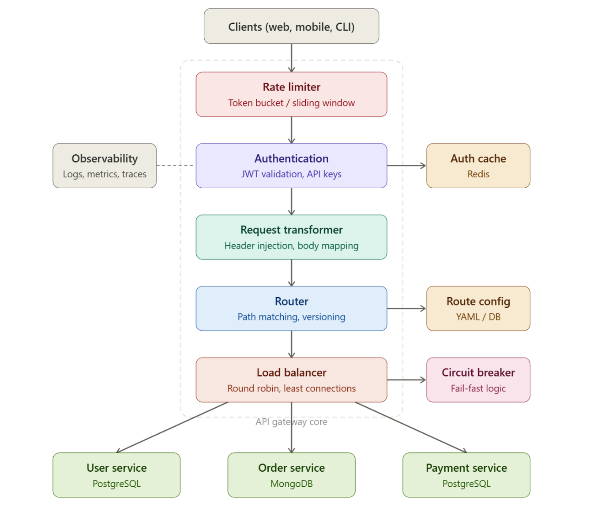

The **API Gateway** is one of the most architecturally rich projects because it's literally the glue of microservices architecture. complete HLD for you.

Here's the full architecture:
**The request lifecycle** — every incoming request flows top-to-bottom through the gateway before reaching any microservice. This pipeline design is the core pattern.

**Layer 1 — Rate Limiter** sits at the very top because there's no point authenticating or routing a request you're going to reject anyway. You'll implement the token bucket algorithm using Redis (each client gets a bucket that refills at a fixed rate). This alone teaches you atomic operations, distributed state, and how to handle burst traffic.

**Layer 2 — Authentication** validates JWT tokens or API keys. You cache validated tokens in Redis so you're not decoding JWTs on every single request. This layer also handles authorization — checking if this user can access this specific route.

**Layer 3 — Request Transformer** modifies the request before it hits your backend. Adding correlation IDs for tracing, injecting internal headers, stripping sensitive headers, transforming request bodies between formats. This is pure middleware pattern.

**Layer 4 — Router** matches the incoming path to a backend service. You'll build a trie-based path matcher that supports wildcards, path parameters, and API versioning (/v1/users/:id → User Service). Route configs are loaded from YAML and support hot-reloading.

**Layer 5 — Load Balancer** distributes requests across multiple instances of each service. You'll implement round-robin, weighted round-robin, and least-connections algorithms. Combined with health checks, this is where you learn service discovery.

**Layer 6 — Circuit Breaker** protects the entire system from cascading failures. If the Payment Service starts failing, the circuit opens and returns fast errors instead of letting requests pile up and bring down everything else. You'll implement the three-state pattern: closed → open → half-open

**Summary of the project workflow:**
**Step 1 — Set up the project**. Create the folder structure, install dependencies, start Redis with Docker.

**Step 2 — Build the config loader (config.py + routes.yaml)**. This is the foundation everything else reads from. Test it by loading the YAML and printing the parsed routes.

**Step 3 — Build the route matcher (route_matcher.py)**. Write a quick test — add routes, match paths, verify params work. This is pure logic with no dependencies.

**Step 4 — Build the load balancer (load_balancer.py)**. Test it standalone — create targets, call pick_target 10 times, verify distribution matches weights.

**Step 5 — Build the proxy engine (proxy.py)**. Start one dummy service, wire up the proxy with the route matcher and balancer, and verify a request flows end to end. This is your first "it works" moment.

**Step 6 — Add authentication (auth.py)**. Add the middleware, seed an API key in Redis, test that unauthenticated requests get rejected and authenticated ones pass through.

**Step 7 — Add rate limiting (rate_limiter.py)**. Add the middleware, hit the gateway in a loop, verify you get 429s after the burst is exhausted.
**Step 8 — Add the circuit breaker (circuit_breaker.py)**. Kill one of the dummy services, send requests, watch the circuit open. Restart the service, wait for recovery timeout, watch it close.
**Step 9 — Add the transformer (transformer.py)**. Check that backend services receive the correlation ID, stripped prefix, and injected headers.
**Step 10 — Add observability (logging_middleware.py)**. Check structured logs and the /metrics endpoint.
